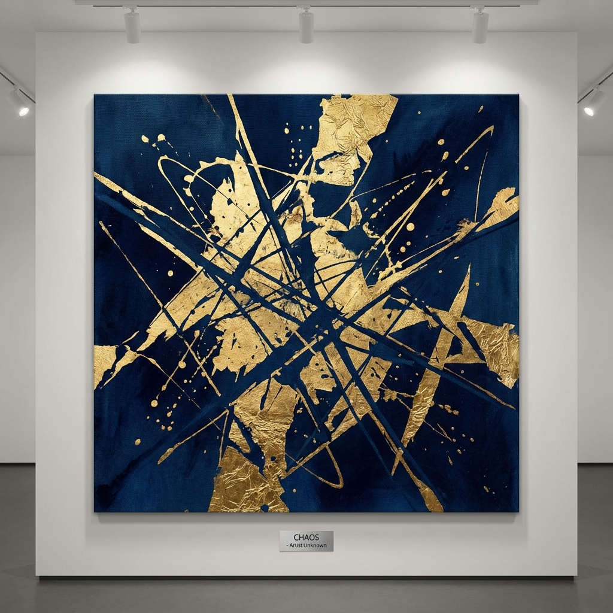

# Project Neptune 🌸

A cinematic, interactive 3D scrollytelling experience built to celebrate Nmasi's 18th birthday. This application takes the user on a journey through different "Acts" of life, visualized as a growing cherry blossom tree.



## 📖 The Story

"Welcome to Year 18. Your journey is officially authorized."

The experience is divided into 5 chapters, each representing a different facet of the journey:

- **Act I: The Beginning** - A secure digital envelope opening the experience.
- **Act II: The Roots** - Exploring origins and heritage (Nsukka).
- **Act III: The Growth** - Core memories and shared laughter.
- **Act IV: The Support** - "The Soul Forest" – an interactive constellation of friends and family.
- **Epilogue: Easter Eggs** - Hidden gems and a vision for the future.

## 🛠️ Tech Stack

Built with cutting-edge web technologies to deliver a premium, app-like feel on the web.

- **Framework**: [Svelte 5](https://svelte.dev/) (Runes mode) & SvelteKit
- **3D Engine**: [Threlte](https://threlte.xyz/) (Three.js for Svelte)
- **Styling**: [TailwindCSS](https://tailwindcss.com/)
- **Animations**: [GSAP](https://gsap.com/) (ScrollTrigger) & Svelte Transitions
- **Deployment**: Vercel
- **Assets**:
  - Draco Compressed 3D Models (Google CDN)
  - Custom Fonts (Athletics)

## ✨ Key Features

- **3D Scrollytelling**: The camera moves cinematically around a 3D Cherry Tree model as the user scrolls, triggered by GSAP timelines.
- **Performance Optimized**: Uses Draco compression for 3D assets to reduce the model size from ~72MB to ~7.5MB.
- **Interactive "Soul Forest"**: A constellation of interactive nodes in Act 4 that bloom on hover.
- **Audio Integration**: Ambient, cinematic storytelling with sound effects.
- **Dynamic Content**: Connected to Supabase for dynamic gallery and content updates.

## 🚀 Getting Started

### Prerequisites

- Node.js (Latest LTS recommended)
- pnpm

### Installation

1. Clone the repository:

   ```bash
   git clone https://github.com/iyosayi0x/nmasi-b-day.git
   cd nmasi-b-day
   ```

2. Install dependencies:

   ```bash
   pnpm install
   ```

3. Run the development server:
   ```bash
   pnpm dev
   ```

## 🏗️ Building for Production

To create a production version of the app:

```bash
pnpm build
```

The application is configured for deployment on **Vercel**.

## 🎨 Credits

- **Concept & Code**: Iyosayi
- **3D Model**: "Cherry Tree" by local.yany (Sketchfab)
- **Inspiration**: A life well-lived.

---

_"Set your heart ablaze. Go beyond your limits!"_
